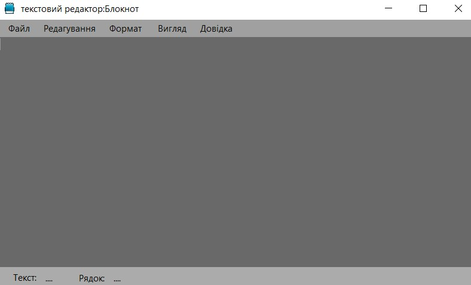
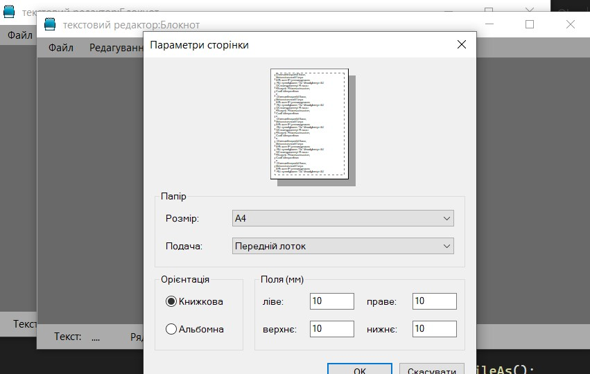
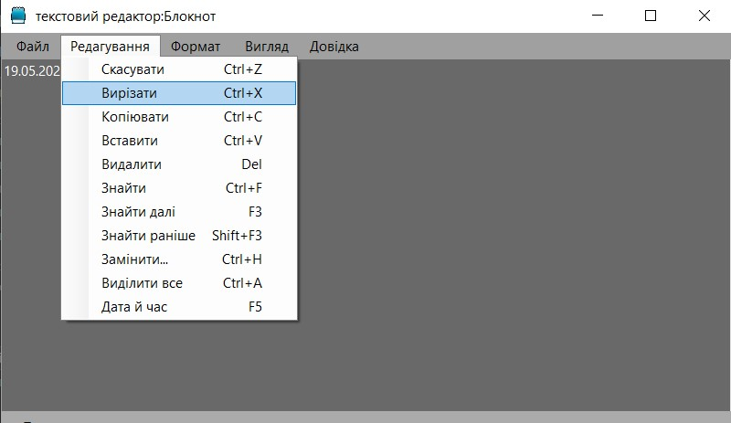
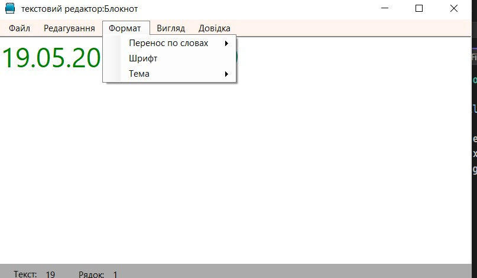
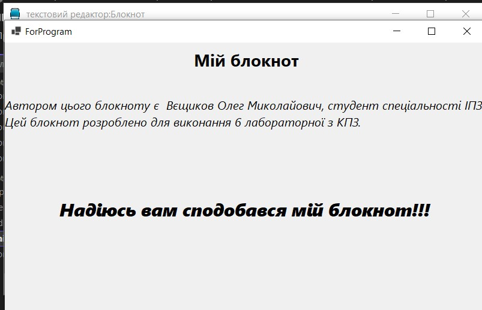

# Notepad Application

## Overview

The Notepad application is a simple text editor built using C#. It allows users to create, open, edit, and save text files. The application also provides features for text formatting, theming, and zooming. It is designed following fundamental programming principles to ensure maintainability, readability, and extensibility.

### briefly about the way the functionality works:

## Features

### File Operations
- **Create New File**: Start a new document.
- **Open File**: Open an existing text file.
- **Save File**: Save the current document.
- **Save File As**: Save the current document with a new name.
- **Page Setup**: Configure page settings for printing.
- **Print**: Print the document.

### Edit Operations
- **Undo**: Undo the last action.
- **Cut**: Cut the selected text.
- **Copy**: Copy the selected text.
- **Paste**: Paste the clipboard content.
- **Delete**: Delete the selected text.
- **Select All**: Select all text in the document.
- **Find and Replace**: Search for text and replace it with new text.
- **Search**: Find text within the document.
- **Insert Date and Time**: Insert the current date and time at the cursor position.

### Formatting
- **Set Font**: Change the font of the text.
- **Light Theme**: Apply a light color theme.
- **Dark Theme**: Apply a dark color theme.
- **Enable Word Wrap**: Wrap text to the next line.
- **Disable Word Wrap**: Disable text wrapping.

### Appearance
- **Zoom In**: Increase the text size.
- **Zoom Out**: Decrease the text size.
- **Restore Zoom**: Restore the default text size.
- **Show Status Bar**: Display the status bar.
- **Hide Status Bar**: Hide the status bar.

## Programming Principles

### Single Responsibility Principle (SRP)
Each class in the application has a single responsibility:
- `FileManager`: Handles file-related operations.
- `TextEditor`: Manages text editing actions.
- `TextFormatter`: Deals with text formatting and theming.
- `AppearanceManager`: Controls zoom and status bar visibility.

### Open/Closed Principle (OCP)
Classes are designed to be extensible without modification. For example, additional formatting options can be added by extending the `TextFormatter` class without changing its existing code.

### Liskov Substitution Principle (LSP)
Subclasses can be used interchangeably with their base classes. For instance, `FileManager`, `TextEditor`, `TextFormatter`, and `AppearanceManager` can be substituted with more specialized versions if needed.

### Interface Segregation Principle (ISP)
The application uses well-defined interfaces that contain only the necessary methods. This allows for more flexible and modular code.

### Dependency Inversion Principle (DIP)
High-level modules do not depend on low-level modules but on abstractions. For instance, `Form1` relies on abstracted functionalities provided by `FileManager`, `TextEditor`, `TextFormatter`, and `AppearanceManager`.

### DRY (Don't Repeat Yourself)
Common functionalities are encapsulated within methods and classes, reducing code duplication.

### KISS (Keep It Simple, Stupid)
The design is straightforward, ensuring that each class and method does one thing well without unnecessary complexity.

### YAGNI (You Aren't Gonna Need It)
The application includes only the features that are currently needed, avoiding over-engineering.

### Composition Over Inheritance
The application favors composition over inheritance to achieve greater flexibility. For example, different managers (`FileManager`, `TextEditor`, `TextFormatter`, `AppearanceManager`) are composed within `Form1`.

### Program to Interfaces, Not Implementations
The application interacts with components through their interfaces, allowing for easy swapping and testing of different implementations.

### Fail Fast
Methods perform early validation and throw exceptions immediately if something is wrong, helping to catch errors early.

## Design Patterns

### Factory Method
A potential factory class can be implemented to instantiate different components (`FileManager`, `TextEditor`, etc.) based on configuration or user input.

### Command Pattern
Encapsulates all text editing actions (`Undo`, `Cut`, `Copy`, `Paste`, etc.) into separate methods within the `TextEditor` class, making them easy to call and extend.

### Memento Pattern
Can be implemented for undo functionality, allowing the application to save and restore the state of the text editor.

## Refactoring Techniques

### Rename Method
Methods have been renamed to accurately describe their functionality.

### Extract Method
Complex methods have been broken down into smaller, more manageable methods to improve readability and maintainability.

### Hide Method
Internal helper methods that are not intended to be used outside their classes are marked as private.

### Consolidate Conditional Expression
Simplified conditional expressions for readability and maintainability.

### Replace Data Value with Object
Simplified and enhanced the management of text and formatting by using dedicated objects and methods.

By adhering to these principles and patterns, the Notepad application is structured for clarity, ease of maintenance, and scalability.
